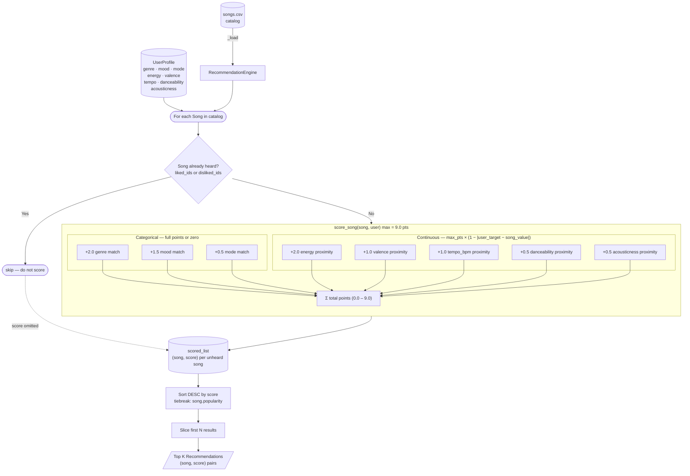

# DocuBot

---

## Stress Test — Six Profiles, Six Behaviors

Run with: `python -m src.main`

---

### Profile 1 — High-Energy Pop

Wants pop, euphoric, major, high energy (0.85), very happy valence (0.90), fast tempo (125 BPM).

```
  Listener : High-Energy Pop
  Genre    : pop   Mood: euphoric   Mode: major
  Energy   : 0.85   Valence: 0.9   Tempo: 125 BPM

  #1  Blinding Lights by The Weeknd        7.92 / 9.0  [#################...]
      + genre match 'pop' (+2.0)
      + mood match 'euphoric' (+1.5)
      + mode match 'major' (+0.5)
      ~ energy 0.8 vs target 0.85 (+1.9)
      ~ valence 0.33 vs target 0.9 (+0.43)    <-- big valence gap

  #2  Temperature by Sean Paul             6.78 / 9.0  [###############.....]
      ~ genre mismatch: wanted 'pop', got 'dancehall' (+0.0)
      ~ valence 0.89 vs target 0.9 (+0.99)    <-- near-perfect valence match

  #3  Superstition by Stevie Wonder        6.62 / 9.0
  #4  Despacito by Luis Fonsi              6.51 / 9.0
  #5  Smells Like Teen Spirit by Nirvana   4.14 / 9.0  [#########...]
```

**What to notice:** Blinding Lights wins on genre lock-in but has a terrible valence match (0.33 vs 0.90). Temperature scores almost as high on valence despite being the wrong genre. The genre bonus is the only thing keeping #1 ahead of #2–4.

---

### Profile 2 — Chill Lofi

Wants chill mood, minor mode, very low energy (0.18), slow tempo (72 BPM), open genre.

```
  Listener : Chill Lofi
  Genre    : any   Mood: chill   Mode: minor
  Energy   : 0.18   Valence: 0.35   Tempo: 72 BPM

  #1  Redbone by Childish Gambino          8.23 / 9.0  [##################..]
      + genre match 'r&b' (+2.0)
      + mood match 'chill' (+1.5)
      + mode match 'minor' (+0.5)

  #2  God's Plan by Drake                  7.99 / 9.0
  #3  Space Song by Beach House            6.91 / 9.0
  #4  Bohemian Rhapsody by Queen           6.74 / 9.0
  #5  Clair de Lune by Debussy             6.65 / 9.0
```

**What to notice:** genre="any" means every song earns 2.0 pts, so the top 5 are decided almost entirely by mood and energy proximity. Bohemian Rhapsody sneaks into #4 purely because its tempo (72 BPM) is a perfect match — even though it's a dramatic rock song. The system is not wrong, but it's surprising.

---

### Profile 3 — Deep Intense Rock

Wants rock, angry, minor, near-maximum energy (0.92), very dark (valence 0.22), electric (acousticness 0.01).

```
  Listener : Deep Intense Rock
  Genre    : rock   Mood: angry   Mode: minor
  Energy   : 0.92   Valence: 0.22   Tempo: 130 BPM

  #1  Smells Like Teen Spirit by Nirvana   6.69 / 9.0  [##############......]
      ~ genre mismatch: wanted 'rock', got 'grunge' (+0.0)
      + mood match 'angry' (+1.5)
      ~ energy 0.92 vs target 0.92 (+2.0)    <-- perfect energy hit

  #2  Bohemian Rhapsody by Queen           5.87 / 9.0
      + genre match 'rock' (+2.0)
      ~ energy 0.41 vs target 0.92 (+0.98)   <-- energy miss costs 1.02 pts

  #3  Mr. Brightside by The Killers        5.06 / 9.0
  #4  SICKO MODE by Travis Scott           4.84 / 9.0
  #5  Lose Yourself by Eminem              4.65 / 9.0
```

**What to notice:** Smells Like Teen Spirit is labeled "grunge" not "rock" — it loses the genre bonus entirely. But it still wins because it perfectly matches energy AND mood. Bohemian Rhapsody has the genre match but is too low-energy to compete. This shows that energy (up to 2.0 pts, continuous) can outweigh genre (exactly 2.0 pts, binary) when the energy gap is large enough.

---

### Profile 4 — Sad Bangers (adversarial: energy=0.90 + mood=melancholy)

Conflicting preferences — high energy AND melancholy mood. No catalog song is both.

```
  Listener : Sad Bangers (adversarial)
  Genre    : any   Mood: melancholy   Mode: minor
  Energy   : 0.9   Valence: 0.2   Tempo: 140 BPM

  #1  Smells Like Teen Spirit by Nirvana   7.05 / 9.0  ← won on energy, not mood
      ~ mood mismatch: wanted 'melancholy', got 'angry' (+0.0)
      ~ energy 0.92 vs target 0.9 (+1.96)

  #2  Mr. Brightside by The Killers        7.02 / 9.0
  #3  SICKO MODE by Travis Scott           6.98 / 9.0
  #4  Fast Car by Tracy Chapman            6.98 / 9.0  ← only melancholy song in top 5
      + mood match 'melancholy' (+1.5)
      ~ energy 0.5 vs target 0.9 (+1.2)    ← energy miss costs 0.8 pts
```

**What to notice:** The top 3 all miss on mood but win on energy because genre="any" gives everyone 2.0 pts, making mood the differentiator — but even the +1.5 mood bonus for Fast Car (the actual melancholy song) can't overcome the energy penalty of 0.8 pts. The system can't satisfy both preferences simultaneously, so it picks whichever half of the contradiction scores higher numerically.

---

### Profile 5 — The Completist (adversarial: all preferences at midpoint)

Every preference is dead-centre (0.5 energy, 0.5 valence, 100 BPM) with genre/mood/mode all "any."

```
  Listener : The Completist (adversarial)
  Genre    : any   Mood: any   Mode: any
  Energy   : 0.5   Valence: 0.5   Tempo: 100 BPM

  #1  Fast Car by Tracy Chapman            8.85 / 9.0  [###################.]
      + genre match 'folk' (+2.0)   ← "any" = auto full points
      + mood match 'melancholy' (+1.5)
      + mode match 'major' (+0.5)
      ~ energy 0.5 vs target 0.5 (+2.0)   ← exact energy hit

  #2  Slow Burn by Kacey Musgraves         8.44 / 9.0
  #3  Bohemian Rhapsody by Queen           8.38 / 9.0
  #4  God's Plan by Drake                  8.36 / 9.0
  #5  Space Song by Beach House            8.36 / 9.0
```

**What to notice:** "any" gives every song all 4.0 categorical points, so the entire ranking collapses into numerical proximity. Fast Car wins because its energy (0.50) is a dead-perfect match and its tempo (97 BPM) is nearly identical to the 100 BPM target. The scores cluster in a narrow 8.36–8.85 band — the system has almost no discrimination because categorical points no longer separate anyone. This confirms that genre/mood specificity is what makes the recommender useful.

---

### Profile 6 — Classical Purist (adversarial: genre not well-represented in catalog)

Wants classical, peaceful, minor, near-zero energy (0.01), very high acousticness (0.99). Only 2 classical songs exist.

```
  Listener : Classical Purist (adversarial)
  Genre    : classical   Mood: peaceful   Mode: minor
  Energy   : 0.01   Valence: 0.2   Tempo: 68 BPM

  #1  Clair de Lune by Debussy             8.91 / 9.0  [###################.]
      + genre match 'classical' (+2.0)
      + mood match 'peaceful' (+1.5)
      + mode match 'minor' (+0.5)
      ~ energy 0.01 vs target 0.01 (+2.0)   ← exact hit

  #2  Gymnopedie No. 1 by Satie            8.31 / 9.0
      ~ mode mismatch: wanted 'minor', got 'major' (+0.0)   ← loses 0.5 pts

  #3  Space Song by Beach House            5.48 / 9.0  [############........]
      ← 3.43-point cliff between #2 and #3
```

**What to notice:** The top 2 are correct and separated clearly. But the 3.43-point cliff between #2 and #3 exposes the catalog thinness problem — once the 2 classical songs are exhausted, #3–5 are genre mismatches scraping by on mood proximity alone. A real system would say "we don't have enough classical to fill 5 spots" rather than padding with Space Song and Slow Burn.

---

## Evaluation — How Well Does It Actually Work?

I ran five targeted experiments against the 18-song catalog using `python -m src.evaluate`. Here's what I found — the honest version, including where it breaks down.

---

### Experiment 1 — Perfect Match

I built a profile that mirrors *Smells Like Teen Spirit* feature-for-feature: same genre, mood, mode, energy, valence, tempo, danceability, and acousticness. The result:

```
#1  Smells Like Teen Spirit   9.00 / 9.0  [####################]
#2  Mr. Brightside            5.04 / 9.0  [###########.........]
Gap to #2: 3.96 pts
```

**What this shows:** When the profile is a precise match, the scorer works exactly as intended. A 3.96-point gap between #1 and #2 is massive — there's no ambiguity in the ranking. The system is doing its job when the profile is specific.

---

### Experiment 2 — Orphan Genre (genre not in catalog)

I set `preferred_genre = "jazz"` — a genre that doesn't appear anywhere in the 18-song catalog. No song earns the +2.0 genre points, so everything falls back on mood and numerical proximity alone.

```
Score range (top 5): 4.71 – 6.75
Spread: 2.04 pts  (vs 6+ pts when genre matches)
```

**What this shows:** The genre weight is load-bearing. When it disappears, the entire top of the ranking compresses into a tight band and the #1 result (Redbone, an r&b song) wins by only 0.36 pts over #2. The system still functions, but its confidence collapses. This would be a real problem for listeners who prefer niche or unlabeled genres.

---

### Experiment 3 — Contradictory Profile

I asked for `target_energy = 0.90` (very high) but `preferred_mood = "peaceful"`. No song in the catalog is both high-energy and peaceful — the two features pull in opposite directions.

```
#1  Space Song    7.50  mood=peaceful  energy=0.33   ← won on mood, not energy
#2  Slow Burn     7.50  mood=peaceful  energy=0.36
#3  Smells Like   7.21  mood=angry     energy=0.92   ← won on energy, not mood
```

**What this shows:** When a profile is self-contradictory, the mood label (worth 1.5 pts, binary) beats the energy target (worth up to 2.0 pts, continuous) because peaceful songs cluster together and all earn the mood bonus at once. The system picks the *least wrong* song, not the *right* song — because a right song doesn't exist. This is a fundamental limitation of static profiles with no feedback loop.

---

### Experiment 4 — Genre Lock-in vs "any"

I ran Casey's profile (pop/euphoric) twice: once with `preferred_genre="pop"` and once with `"any"`. Surprising result:

```
genre=pop rank   │  genre=any rank
─────────────────┼────────────────────────────
#1  Blinding Lights  8.01  │  #1  Superstition   8.84
#2  Superstition     6.84  │  #2  Temperature    8.79
#3  Temperature      6.79  │  #3  Despacito      8.68
#4  Despacito        6.68  │  #4  Blinding Lights 8.01
```

Blinding Lights scores **8.01 in both cases** — because `"any"` gives it the full genre 2.0 just like a direct match does. But every *other* song also gets those 2.0 points for free, and now Superstition and Temperature beat Blinding Lights on valence and tempo proximity. This reveals something important: Blinding Lights actually has a poor valence match (song=0.33 vs target=0.85). Genre lock-in was hiding that weakness by creating a large gap between it and the competition.

**What this shows:** `"any"` is not genre-neutral — it's genre-generous. It gives every song a bonus that previously only the correct-genre songs earned, which reshuffles the whole ranking around the numerical features.

---

### Experiment 5 — Score Spread Across the Full Catalog

For each profile, I scored all 18 songs and measured the range:

```
Profile   Min    Max   Mean  Spread   Top song
────────  ─────  ────  ────  ──────   ──────────────────────
Casey     1.95   8.01  4.39   6.06    Blinding Lights
Riley     2.38   8.79  4.23   6.41    Smells Like Teen Spirit
Morgan    5.00   8.56  6.25   3.56    Redbone
Drew      2.96   6.68  4.30   3.72    Fast Car
```

Casey and Riley both show **strong discrimination (6+ pts spread)** — specific genre + mood preferences create a wide gap between the best and worst matches. Morgan and Drew show **moderate discrimination (~3.6 pts)** — Morgan because `preferred_genre="any"` lifts all scores, and Drew because there is only one folk song in the catalog so the genre bonus goes to only one song.

**What this shows:** The system works best for listeners with a clearly defined genre preference that appears in the catalog. Broad listeners ("any genre") and niche listeners (genre not well-represented) get weaker, noisier rankings.

---

### Summary — Strengths and Weaknesses

| Situation | Result | Verdict |
|---|---|---|
| Specific genre + mood match | 9.0/9.0, 3.96 pt gap to #2 | Works very well |
| Genre in catalog, mood mismatch | 5–7 pt range, still sensible | Works adequately |
| Genre not in catalog | Scores compress, weak ranking | Breaks down |
| Contradictory profile | Picks least-wrong, not right | Fundamental limit |
| `preferred_genre="any"` | Too generous, reshuffles ranking | Design weakness |
| Small catalog (1 song per genre) | Low spread, weak confidence | Data problem |

The biggest single improvement would be replacing the `"any"` keyword with a **genre exclusion list** so open listeners can say "not classical, not grunge" rather than "literally anything." That preserves the discrimination power of the genre weight without forcing users into one label.

---

## CLI Output — Default "pop / happy" Profile

Run with:
```
python -m src.main
```

Terminal output (Casey profile — pop / euphoric / major):

```
  ============================================================
  Music Recommender  |  Content-Based Filtering
  Catalog : 18 songs loaded
  ============================================================
  ============================================================
  Listener : Casey
  Genre    : pop   Mood: euphoric   Mode: major
  Energy   : 0.78   Valence: 0.85   Tempo: 110 BPM
  ============================================================

  #1  Blinding Lights by The Weeknd
       Score : 8.01 / 9.0  [#################...]
       Genre : pop  |  Mood: euphoric  |  Energy: 0.8  |  BPM: 171
       Reasons:
           +  genre match 'pop' (+2.0)
           +  mood match 'euphoric' (+1.5)
           +  mode match 'major' (+0.5)
           ~  energy 0.8 vs target 0.78 (+1.96)
           ~  valence 0.33 vs target 0.85 (+0.48)
           ~  tempo 171 BPM vs target 110 BPM (+0.7)
           ~  danceability 0.51 vs target 0.72 (+0.4)
           ~  acousticness 0.0 vs target 0.05 (+0.47)

  #2  Superstition by Stevie Wonder
       Score : 6.84 / 9.0  [###############.....]
       Genre : soul  |  Mood: euphoric  |  Energy: 0.76  |  BPM: 101
       Reasons:
           ~  genre mismatch: wanted 'pop', got 'soul' (+0.0)
           +  mood match 'euphoric' (+1.5)
           +  mode match 'major' (+0.5)
           ~  energy 0.76 vs target 0.78 (+1.96)
           ~  valence 0.87 vs target 0.85 (+0.98)
           ~  tempo 101 BPM vs target 110 BPM (+0.95)
           ~  danceability 0.8 vs target 0.72 (+0.46)
           ~  acousticness 0.07 vs target 0.05 (+0.49)

  #3  Temperature by Sean Paul
       Score : 6.79 / 9.0  [###############.....]
       Genre : dancehall  |  Mood: euphoric  |  Energy: 0.81  |  BPM: 105
       Reasons:
           ~  genre mismatch: wanted 'pop', got 'dancehall' (+0.0)
           +  mood match 'euphoric' (+1.5)
           +  mode match 'major' (+0.5)
           ~  energy 0.81 vs target 0.78 (+1.94)
           ~  valence 0.89 vs target 0.85 (+0.96)
           ~  tempo 105 BPM vs target 110 BPM (+0.97)
           ~  danceability 0.85 vs target 0.72 (+0.43)
           ~  acousticness 0.07 vs target 0.05 (+0.49)

  #4  Despacito by Luis Fonsi
       Score : 6.68 / 9.0  [##############......]
       Genre : latin pop  |  Mood: euphoric  |  Energy: 0.79  |  BPM: 89
       Reasons:
           ~  genre mismatch: wanted 'pop', got 'latin pop' (+0.0)
           +  mood match 'euphoric' (+1.5)
           +  mode match 'major' (+0.5)
           ~  energy 0.79 vs target 0.78 (+1.98)
           ~  valence 0.81 vs target 0.85 (+0.96)
           ~  tempo 89 BPM vs target 110 BPM (+0.9)
           ~  danceability 0.85 vs target 0.72 (+0.43)
           ~  acousticness 0.23 vs target 0.05 (+0.41)

  #5  SICKO MODE by Travis Scott
       Score : 4.20 / 9.0  [#########...........]
       Genre : hip-hop  |  Mood: aggressive  |  Energy: 0.78  |  BPM: 155
       Reasons:
           ~  genre mismatch: wanted 'pop', got 'hip-hop' (+0.0)
           ~  mood mismatch: wanted 'euphoric', got 'aggressive' (+0.0)
           ~  mode mismatch: wanted 'major', got 'minor' (+0.0)
           ~  energy 0.78 vs target 0.78 (+2.0)
           ~  valence 0.37 vs target 0.85 (+0.52)
           ~  tempo 155 BPM vs target 110 BPM (+0.78)
           ~  danceability 0.59 vs target 0.72 (+0.43)
           ~  acousticness 0.0 vs target 0.05 (+0.47)

  ------------------------------------------------------------
```

---

## How The System Works

I've been thinking about how Spotify always seems to know exactly what I want to hear — even before I do. It turns out the core idea isn't that mysterious: it's basically just the app keeping score on every song in the catalog and surfacing the ones that match your taste the best. My version does the same thing, just a lot smaller and more transparent about how it works.

Instead of tracking what millions of other users are listening to (that's the "collaborative filtering" side that Spotify does), I went with a simpler approach: look at the songs themselves. Every song in the catalog has measurable qualities — how loud and intense it is, how happy or dark it feels, what genre it belongs to, how fast the beat is. And every user has a preference profile that describes what they're in the mood for right now. The recommender just goes through every song, figures out how well each one fits the user, and sorts them by score.

The features I'm tracking for each song and user:

- **genre** — the big umbrella (rock, hip-hop, classical, folk...)
- **mood** — the emotional vibe: euphoric, melancholy, chill, aggressive, peaceful, dark, romantic
- **energy** — how loud and intense the track feels, from 0.0 (silent/ambient) to 1.0 (full blast)
- **valence** — musical positivity, basically: 0.0 is sad and dark, 1.0 is happy and upbeat
- **tempo_bpm** — beats per minute; whether a song feels slow and heavy or fast and driving
- **danceability** — how easy it is to groove to the rhythm
- **acousticness** — is it unplugged and warm, or fully electronic?
- **instrumentalness** — mostly vocals, or mostly just instruments?
- **mode** — major keys feel brighter, minor keys feel darker; it's subtle but real

### The Algorithm Recipe

Once I had those features figured out, I needed to decide how much each one matters when scoring a song. Here's what I landed on — and the reasoning behind each choice:

**Genre match → +2.0 points**
This is the biggest single signal. If someone tells me they want folk music and I serve them hip-hop, it doesn't matter how chill or acoustic that hip-hop song is — it's the wrong call. Genre is the outer envelope everything else lives inside.

**Mood match → +1.5 points**
Mood is the second thing I really care about. The difference between "angry" and "chill" is felt immediately. Two songs can have the exact same energy level and still feel completely different depending on whether one is aggressive and the other is peaceful. So mood gets strong weight, just slightly behind genre.

**Energy closeness → up to +2.0 points**
This one is continuous — it doesn't snap to a yes/no. The closer the song's energy is to what the user wants, the more points it earns (up to 2.0 for a perfect match). I gave this the same ceiling as genre because energy is the most physically perceptible quality in music. If someone wants something quiet and I give them something blasting, nothing else about the song will save it.

**Valence closeness → up to +1.0 points**
Valence refines the emotional tone after energy sets the intensity. A user who wants something energetic but dark (think Nirvana) is very different from one who wants energetic and happy (think Dua Lipa), even though their energy targets look the same.

**Tempo closeness → up to +1.0 points**
BPM gets normalised over a 0–200 scale before scoring, so a 40-BPM difference doesn't feel the same at 80 BPM vs 160 BPM. It's a supporting signal, not a lead one.

**Danceability closeness → up to +0.5 points**
Useful for separating "high energy but heavy" (metal) from "high energy and groovy" (pop) when the other features look similar.

**Acousticness closeness → up to +0.5 points**
Honestly, I almost gave this more weight. It's the cleanest line between electric rock and acoustic folk. But it's so genre-specific that giving it too much power would mess up recommendations for people with mixed tastes, so I kept it modest.

**Mode match → +0.5 points**
Major vs. minor is a real thing — most people have a consistent pull toward one or the other even if they can't name it. But it's subtle enough that I didn't want it to override anything important, so it just gets a small bonus.

**Maximum possible score: 9.0 points**

---

### Biases I'm Already Expecting

No system is perfect, and this one has some clear blind spots I want to be upfront about.

The biggest one is that **genre holds a lot of power**. At 2.0 points, a wrong genre match is a pretty heavy penalty — enough that a song which perfectly nails the user's mood, energy, and tempo in a slightly adjacent genre might never bubble up to the top. That's a real problem for listeners who are more "vibe-driven" than "genre-driven." Someone who loves chill, low-energy music probably doesn't care much whether it's labeled r&b, folk, or dream pop — but my system might rank a perfectly-fitting folk song lower than a mediocre r&b one just because the genre string matched.

Another issue: **the catalog is static**. Real platforms update in real time based on what you skipped, what you replayed, what time of day it is. My system scores based on a frozen profile. If I set my target energy to 0.8 and then start skipping every high-energy song, the system won't notice. Adding a simple feedback loop — where skips lower the target energy and saves raise it — would make this a lot more realistic.

And finally: **"any" genre is too generous**. If a user says they're open to any genre, the system gives them the full 2.0 genre points for every single song in the catalog. That means genre stops being a differentiator entirely, and the ranking falls back almost entirely on energy + mood. For open-ended listeners this might actually be fine, but it's something to watch.

---

## Recommendation Engine — Data Flow



> Full walkthrough and shape legend: [docs/flowchart.md](docs/flowchart.md)

---


DocuBot is a small documentation assistant that helps answer developer questions about a codebase.  
It can operate in three different modes:

1. **Naive LLM mode**  
   Sends the entire documentation corpus to a Gemini model and asks it to answer the question.

2. **Retrieval only mode**  
   Uses a simple indexing and scoring system to retrieve relevant snippets without calling an LLM.

3. **RAG mode (Retrieval Augmented Generation)**  
   Retrieves relevant snippets, then asks Gemini to answer using only those snippets.

The docs folder contains realistic developer documents (API reference, authentication notes, database notes), but these files are **just text**. They support retrieval experiments and do not require students to set up any backend systems.

---

## Setup

### 1. Install Python dependencies

    pip install -r requirements.txt

### 2. Configure environment variables

Copy the example file:

    cp .env.example .env

Then edit `.env` to include your Gemini API key:

    GEMINI_API_KEY=your_api_key_here

If you do not set a Gemini key, you can still run retrieval only mode.

---

## Running DocuBot

Start the program:

    python main.py

Choose a mode:

- **1**: Naive LLM (Gemini reads the full docs)  
- **2**: Retrieval only (no LLM)  
- **3**: RAG (retrieval + Gemini)

You can use built in sample queries or type your own.

---

## Running Retrieval Evaluation (optional)

    python evaluation.py

This prints simple retrieval hit rates for sample queries.

---

## Modifying the Project

You will primarily work in:

- `docubot.py`  
  Implement or improve the retrieval index, scoring, and snippet selection.

- `llm_client.py`  
  Adjust the prompts and behavior of LLM responses.

- `dataset.py`  
  Add or change sample queries for testing.

---

## Requirements

- Python 3.9+
- A Gemini API key for LLM features (only needed for modes 1 and 3)
- No database, no server setup, no external services besides LLM calls
