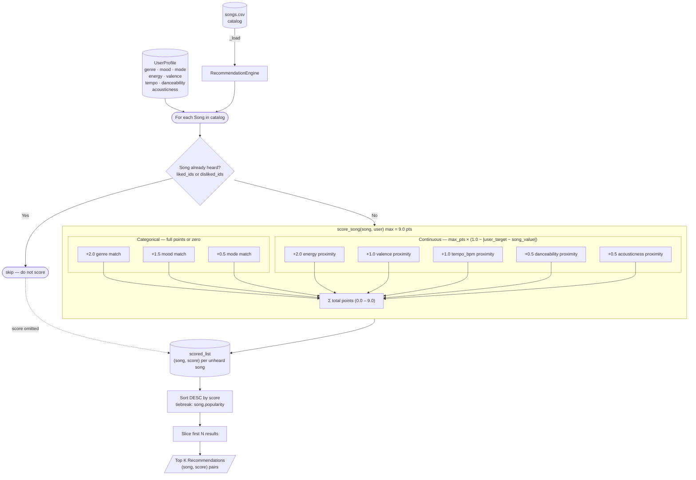

# Recommendation Engine — Data Flow

## Reading the diagram

| Shape | Meaning |
|---|---|
| Cylinder `(( ))` | Persistent data — the CSV file or the scored list |
| Stadium `([ ])` | Loop step or terminal action |
| Diamond `{ }` | Decision / branch |
| Rectangle | Process step |
| Rounded rectangle `(( ))` | Data store |
| Subgraph border | Groups steps that belong to one function |
| Dashed arrow `-.->` | Skipped songs contribute nothing to the list |

## One song's journey — walkthrough

1. **Load** — `RecommendationEngine._load()` reads every row of `songs.csv` into a `Song` dataclass.
2. **Loop** — `recommend()` iterates over every `Song` in `self.catalog`.
3. **Filter** — if the song's `id` is in `user.liked_ids` or `user.disliked_ids` it is skipped entirely (the user has already heard it).
4. **Score** — `scorer.score_song(song, user)` runs two parallel sub-calculations:
   - **Categorical**: genre, mood, and mode each earn their full ceiling or zero.
   - **Continuous**: energy, valence, tempo, danceability, and acousticness each earn a fraction of their ceiling based on how close they are to the user's target.
5. **Collect** — the `(song, score)` pair is appended to `scored_list`.
6. **Rank** — after every song has been evaluated, `scored_list` is sorted by score descending.  Ties are broken by `song.popularity` (also descending) so the more popular song surfaces first.
7. **Slice** — only the first `top_n` pairs are returned to the caller.
